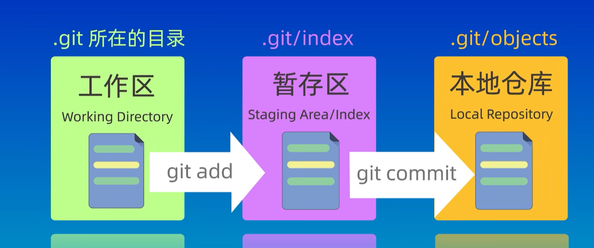

1、git的本地数据管理分为三个区域，分别是工作区(Working Directort),暂存区(Staging Area/Index(索引)),本地仓库(Local Repository).  
(1) 工作区:又称为工作目录或者本地目录,就是我们电脑上的目录，资源管理器里面看到的目录就是工作区。  
(2) 暂存区:是一种临时存储区域，用于保存即将提交到Git仓库的修改内容。暂存区是进行版本控制非常重要的一个区域。    
(3) 本地仓库:本地仓库是指用git init命令创建出来的仓库。包含了完整的项目历史和元数据，是Git存储代码和版本信息的重要位置。

总结:工作区就是我们操作的目录，暂存区就是临时存储即将提交的修改内容，本地仓库是Git存储代码和版本信息的主要位置。  

三个区域的流程:  

在这个过程中我们可以使用git提供的命令来查看比较或者撤销修改内容，来保证版本控制的准确性和完整性。  

2、Git中文件的四种状态。    
(1) 未跟踪(Untrack):指的是我们已经创建但是还没有被git管理起来的文件。    
(2) 未修改(Unmodified):指的是已经被git管理起来的但是内容没有发生改变的文件，就是未修改的文件。   
(3) 已修改(Modified):指的是已经修改过的文件，但是还没有添加到暂存区里面的文件。    
(4) 已暂存(Staged):指的是修改后已经添加到暂存区内的文件。  

  